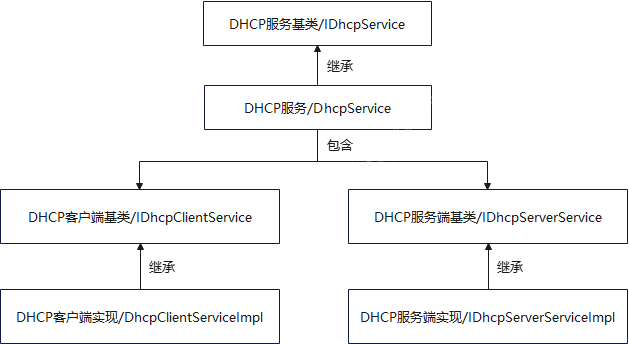

# DHCP组件

#### 介绍
动态主机配置协议 DHCP（Dynamic Host Configuration Protocol，动态主机配置协议） 是 RFC 1541定义的标准协议，该协议允许服务器向客户端动态分配IP地址和配置信息。DHCP协议支持C/S（客户端/服务器）结构，主要分为两部分：

1、DHCP客户端：通常为网络中的手机、PC、打印机等终端设备，使用从DHCP服务器分配下来的IP信息，包括IP地址、默认网关及DNS等。

2、DHCP服务器：用于管理所有的IP网络信息，并处理客户端的DHCP请求，为接入的客户端分配IP地址、子网掩码、默认网关等内容。
#### 软件架构
软件架构说明：
如下图所示，DhcpService类提供外部管理DHCP模块服务的接口，其中包含了DHCP客户端服务的启动、停止及结果获取，DHCP服务端的启动、停止及地址池和租约表的管理等等，方便其它各子系统业务实现中调用DhcpService业务的接口。

#### 使用说明

1. 调用类DhcpServiceApi获取IDhcpService实例；
2. 通过IDhcpService实例启动DHCP功能（Client/Server）；
3. Client端通过GetDhcpResult注册DhcpResultNotify类的回调；
4. Server端通过GetDhcpSerProExit获取DHCP Server异常退出的通知。

#### 相关仓

communication_wifi