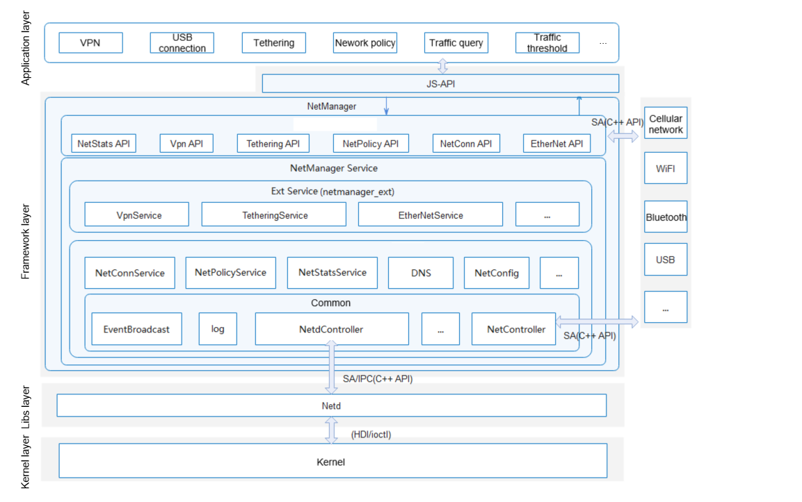

# NetManager

## Introduction

The NetManager module is a tailorable component of the Telephony subsystem. Key components of the module include NetConnService (connection management), NetPolicyService (policy management), NetStatsService (traffic management), TetheringService (network sharing), VpnService (VPN management), and EtherNetService (Ethernet connection).

**Figure 1**  NetManager architecture



## Directory Structure

```
foundation/communication/netmanager_base/
├─figures                     // Architecture
├─frameworks                  // Framework layer
│  ├─js                       // JavaScript APIs
│  └─native                   // Native APIs
├─interfaces                  // API definitions
│  ├─innerkits                // JavaScript APIs
│  └─kits                     // Native APIs
├─sa_profile                  // SA profile
├─services                    // IPC server-side implementation
├─test                        // Test code
└─utils                       // Utilities
```

## Available APIs

| Type| API| Description|
| ---- | ---- | ---- |
| ohos.net.connection | function getDefaultNet(callback: AsyncCallback\<NetHandle>): void; |Creates a **NetHandle** object that contains the **netId** of the default network. This API uses an asynchronous callback to return the result.|
| ohos.net.connection | function getDefaultNet(): Promise\<NetHandle>; |Creates a **NetHandle** object that contains the **netId** of the default network. This API uses a promise to return the result.|
| ohos.net.connection | function getAllNets(callback: AsyncCallback\<Array\<NetHandle>>): void;| Obtains the list of **NetHandle** objects of the connected network. This API uses an asynchronous callback to return the result.|
| ohos.net.connection | function getAllNets(): Promise\<Array\<NetHandle>>;| Obtains the list of **NetHandle** objects of the connected network. This API uses a promise to return the result.|
| ohos.net.connection | function getConnectionProperties(netHandle: NetHandle, callback: AsyncCallback\<ConnectionProperties>): void; |Obtains link information of the default network. This API uses an asynchronous callback to return the result.|
| ohos.net.connection | function getConnectionProperties(netHandle: NetHandle): Promise\<ConnectionProperties>; |Obtains link information of the default network. This API uses a promise to return the result.|
| ohos.net.connection | function getNetCapabilities(netHandle: NetHandle, callback: AsyncCallback\<NetCapabilities>): void; |Obtains the capability set of the default network. This API uses an asynchronous callback to return the result.|
| ohos.net.connection | function getNetCapabilities(netHandle: NetHandle): Promise\<NetCapabilities>; |Obtains the capability set of the default network. This API uses a promise to return the result.|
| ohos.net.connection | function hasDefaultNet(callback: AsyncCallback\<boolean>): void; |Checks whether the default network is available. This API uses an asynchronous callback to return the result.|
| ohos.net.connection | function hasDefaultNet(): Promise\<boolean>; |Checks whether the default network is available. This API uses a promise to return the result.|
| ohos.net.connection | function getAddressesByName(host: string, callback: AsyncCallback\<Array\<NetAddress>>): void; |Obtains all IP addresses of the specified network by resolving the domain name. This API uses an asynchronous callback to return the result.|
| ohos.net.connection | function getAddressesByName(host: string): Promise\<Array\<NetAddress>>; |Obtains all IP addresses of the specified network by resolving the domain name. This API uses a promise to return the result.|
| ohos.net.connection | function createNetConnection(netSpecifier?: NetSpecifier, timeout?: number): NetConnection; | Creates a **NetConnection** object. **netSpecifier** specifies the network, and **timeout** specifies the timeout interval in ms. **timeout** is configurable only when **netSpecifier** is specified. If neither of them is present, the default network is used.|
| ohos.net.connection | function enableAirplaneMode(callback: AsyncCallback\<void>): void; | Enables the airplane mode. This API uses an asynchronous callback to return the result.|
| ohos.net.connection | function enableAirplaneMode(): Promise\<void>;|Enables the airplane mode. This API uses a promise to return the result.|
| ohos.net.connection | function disableAirplaneMode(callback: AsyncCallback\<void>): void;| Disables the airplane mode. This API uses an asynchronous callback to return the result.|
| ohos.net.connection | function disableAirplaneMode(): Promise\<void>;| Disables the airplane mode. This API uses a promise to return the result.|
| ohos.net.connection | function reportNetConnected(netHandle: NetHandle, callback: AsyncCallback\<void>): void;| Reports a **netAavailable** event to NetManager. If this API is called, the application considers that its network status (ohos.net.connection.NetCap.NET_CAPABILITY_VAILDATED) is inconsistent with that of NetManager. This API uses an asynchronous callback to return the result.|
| ohos.net.connection | function reportNetConnected(netHandle: NetHandle): Promise\<void>;| Reports a **netAavailable** event to NetManager. If this API is called, the application considers that its network status (ohos.net.connection.NetCap.NET_CAPABILITY_VAILDATED) is inconsistent with that of NetManager. This API uses a promise to return the result.|
| ohos.net.connection | function reportNetDisconnected(netHandle: NetHandle, callback: AsyncCallback\<void>): void;| Reports a **netUnavailable** event to NetManager. If this API is called, the application considers that its network status (ohos.net.connection.NetCap.NET_CAPABILITY_VAILDATED) is inconsistent with that of NetManager. This API uses an asynchronous callback to return the result.|
| ohos.net.connection | function reportNetDisconnected(netHandle: NetHandle): Promise\<void>;| Reports a **netUnavailable** event to NetManager. If this API is called, the application considers that its network status (ohos.net.connection.NetCap.NET_CAPABILITY_VAILDATED) is inconsistent with that of NetManager. This API uses a promise to return the result.|
| ohos.net.connection.NetHandle | bindSocket(socketParam: TCPSocket \| UDPSocket, callback: AsyncCallback\<void>): void; | Binds TCPSocket or UDPSocket to the current network. This API uses an asynchronous callback to return the result.|
| ohos.net.connection.NetHandle | bindSocket(socketParam: TCPSocket \| UDPSocket): Promise\<void>;| Binds TCPSocket or UDPSocket to the current network. This API uses a promise to return the result.|
| ohos.net.connection.NetHandle | getAddressesByName(host: string, callback: AsyncCallback\<Array\<NetAddress>>): void; |Obtains all IP addresses of the default network by resolving the domain name. This API uses an asynchronous callback to return the result.|
| ohos.net.connection.NetHandle | getAddressesByName(host: string): Promise\<Array\<NetAddress>>; |Obtains all IP addresses of the specified network by resolving the domain name. This API uses a promise to return the result.|
| ohos.net.connection.NetHandle | getAddressByName(host: string, callback: AsyncCallback\<NetAddress>): void; |Obtains an IP address of the specified network by resolving the domain name. This API uses an asynchronous callback to return the result.|
| ohos.net.connection.NetHandle | getAddressByName(host: string): Promise\<NetAddress>; |Obtains an IP address of the specified network by resolving the domain name. This API uses a promise to return the result.|
| ohos.net.connection.NetConnection | on(type: 'netAvailable', callback: Callback\<NetHandle>): void; |Listens to **netAvailable** events.|
| ohos.net.connection.NetConnection | on(type: 'netCapabilitiesChange', callback: Callback\<{ netHandle: NetHandle, netCap: NetCapabilities }>): void; |Listens to **netCapabilitiesChange** events.|
| ohos.net.connection.NetConnection | on(type: 'netConnectionPropertiesChange', callback: Callback\<{ netHandle: NetHandle, connectionProperties: ConnectionProperties }>): void; |Listens to **netConnectionPropertiesChange** events.|
| ohos.net.connection.NetConnection | on(type: 'netLost', callback: Callback\<NetHandle>): void; |Listens to **netLost** events.|
| ohos.net.connection.NetConnection | on(type: 'netUnavailable', callback: Callback\<void>): void; |Listens to **netUnavailable** events.|
| ohos.net.connection.NetConnection | register(callback: AsyncCallback\<void>): void; |Registers an observer for the default network or the network specified in **createNetConnection**.|
| ohos.net.connection.NetConnection | unregister(callback: AsyncCallback\<void>): void; |Unregisters the observer for the default network or the network specified in **createNetConnection**.|
| @ohos.net.policy | function setBackgroundPolicy(allow: boolean, callback: AsyncCallback\<void>): void; | Sets the background network policy. This API uses an asynchronous callback to return the result.|
| @ohos.net.policy | function setBackgroundPolicy(allow: boolean): Promise\<void>; | Sets the background network policy. This API uses a promise to return the result.|
| @ohos.net.policy | function getBackgroundPolicy(callback: AsyncCallback\<NetBackgroundPolicy>): void; | Obtains the background network policy. This API uses an asynchronous callback to return the result.|
| @ohos.net.policy | function getBackgroundPolicy(): Promise\<NetBackgroundPolicy>; | Obtains the background network policy. This API uses a promise to return the result.|
| @ohos.net.policy | function setPolicyByUid(uid: number, policy: NetUidPolicy, callback: AsyncCallback\<void>): void; | Sets the network access policy for the application by the specified UID. This API uses an asynchronous callback to return the result.|
| @ohos.net.policy | function setPolicyByUid(uid: number, policy: NetUidPolicy): Promise\<void>; | Sets the network access policy for the application by the specified UID. This API uses a promise to return the result.|
| @ohos.net.policy | function getPolicyByUid(uid: number, callback: AsyncCallback\<NetUidPolicy>): void; | Obtains the network access policy of the application by the specified UID. This API uses an asynchronous callback to return the result.|
| @ohos.net.policy | function getPolicyByUid(uid: number): Promise\<NetUidPolicy>; | Obtains the network access policy of the application by the specified UID. This API uses a promise to return the result.|
| @ohos.net.policy | function getUidsByPolicy(policy: NetUidPolicy, callback: AsyncCallback\<Array\<number>>): void; | Obtains the UID array of the application by the network access policy. This API uses an asynchronous callback to return the result.|
| @ohos.net.policy | function getUidsByPolicy(policy: NetUidPolicy): Promise\<Array\<number>>; | Obtains the UID array of the application by the network access policy. This API uses a promise to return the result.|
| @ohos.net.policy | function getNetQuotaPolicies(callback: AsyncCallback\<Array\<NetQuotaPolicy>>): void; | Obtains the network quota policy. This API uses an asynchronous callback to return the result.|
| @ohos.net.policy | function getNetQuotaPolicies(): Promise\<Array\<NetQuotaPolicy>>; | Obtains the network quota policy. This API uses a promise to return the result.|
| @ohos.net.policy | function setNetQuotaPolicies(quotaPolicies: Array\<NetQuotaPolicy>, callback: AsyncCallback\<void>): void; | Sets the network quota policy. This API uses an asynchronous callback to return the result.|
| @ohos.net.policy | function setNetQuotaPolicies(quotaPolicies: Array\<NetQuotaPolicy>): Promise\<void>; | Sets the network quota policy. This API uses a promise to return the result.|
| @ohos.net.policy | function restoreAllPolicies(simId: string, callback: AsyncCallback\<void>): void; | Restores all policies, including cellular network, background network, firewall, and application-specific policies, by the SIM ID. This API uses an asynchronous callback to return the result.|
| @ohos.net.policy | function restoreAllPolicies(simId: string): Promise\<void>; | Restores all policies, including cellular network, background network, firewall, and application-specific policies, by the SIM ID. This API uses a promise to return the result.|
| @ohos.net.policy | function isUidNetAllowedIsMetered(uid: number, isMetered: boolean, callback: AsyncCallback\<boolean>): void; | Checks whether the application corresponding to the specified UID can access the metering or non-metering network. This API uses an asynchronous callback to return the result.|
| @ohos.net.policy | function isUidNetAllowedIsMetered(uid: number, isMetered: boolean): Promise\<boolean>; | Checks whether the application corresponding to the specified UID can access the metering or non-metering network. This API uses a promise to return the result.|
| @ohos.net.policy | function isUidNetAllowedIface(uid: number, iface: string, callback: AsyncCallback\<boolean>): void; | Checks whether the application corresponding to the specified UID can access the network corresponding to the specified iface. This API uses an asynchronous callback to return the result.|
| @ohos.net.policy | function isUidNetAllowedIface(uid: number, iface: string): Promise\<boolean>; | Checks whether the application corresponding to the specified UID can access the network corresponding to the specified iface. This API uses a promise to return the result.|
| @ohos.net.policy | function setDeviceIdleAllowlist(uid: number, isAllow: boolean, callback: AsyncCallback\<void>): void | Sets whether the application corresponding to the specified UID is in the device idle allowlist. This API uses an asynchronous callback to return the result.|
| @ohos.net.policy | function setDeviceIdleAllowlist(uid: number, isAllow: boolean): Promise\<void>; | Sets whether the application corresponding to the specified UID is in the device idle allowlist. This API uses a promise to return the result.|
| @ohos.net.policy | function getDeviceIdleAllowlist(callback: AsyncCallback\<Array\<number>>): void | Obtains the UID array of the application in the device idle allowlist. This API uses an asynchronous callback to return the result.|
| @ohos.net.policy | function getDeviceIdleAllowlist(): Promise\<Array\<number>>; | Obtains the UID array of the application in the device idle allowlist. This API uses a promise to return the result.|
| @ohos.net.policy | function getBackgroundPolicyByUid(uid: number, callback: AsyncCallback\<NetBackgroundPolicy>): void | Checks whether the application corresponding to the specified UID can access the background network. This API uses an asynchronous callback to return the result.|
| @ohos.net.policy | function getBackgroundPolicyByUid(uid: number): Promise\<NetBackgroundPolicy>; | Checks whether the application corresponding to the specified UID can access the background network. This API uses a promise to return the result.|
| @ohos.net.policy | function resetPolicies(simId: string, callback: AsyncCallback\<void>): void; | Resets all policies, including cellular network, background network, firewall, and application-specific policies, by the SIM ID. This API uses an asynchronous callback to return the result.|
| @ohos.net.policy | function resetPolicies(simId: string): Promise\<void>; | Resets all policies, including cellular network, background network, firewall, and application-specific policies, by the SIM ID. This API uses a promise to return the result.|
| @ohos.net.policy | function updateRemindPolicy(netType: NetBearType, simId: string, remindType: RemindType, callback: AsyncCallback\<void>): void | Updates the reminder policy. **netType** indicates the network type, **simId** indicates the SIM card ID, and **remindType** indicates the reminder type. This API uses an asynchronous callback to return the result.|
| @ohos.net.policy | function updateRemindPolicy(netType: NetBearType, simId: string, remindType: RemindType): Promise\<void>; | Updates the reminder policy. **netType** indicates the network type, **simId** indicates the SIM card ID, and **remindType** indicates the reminder type. This API uses a promise to return the result.|
| @ohos.net.policy | function on(type: 'netUidPolicyChange', callback: Callback\<{ uid: number, policy: NetUidPolicy }>): void; | Registers the callback for policy changes.|
| @ohos.net.policy | function off(type: 'netUidPolicyChange', callback: Callback\<void>): void; | Unregisters the callback for policy changes.|
| @ohos.net.policy | function on(type: "netUidRuleChange", callback: Callback\<{ uid: number, rule: NetUidRule }>): void; | Registers the callback for rule changes.|
| @ohos.net.policy | function off(type: "netUidRuleChange", callback: Callback\<void>): void; | Unregisters the callback for rule changes.|
| @ohos.net.policy | function on(type: "netMeteredIfacesChange", callback: Callback\<Array\<string>>): void; | Registers the callback for metered iface changes.|
| @ohos.net.policy | function off(type: "netMeteredIfacesChange", callback: Callback\<void>): void; | Unregisters the callback for metered iface changes.|
| @ohos.net.policy | function on(type: "netQuotaPolicyChange", callback: Callback\<Array\<NetQuotaPolicy>>): void; | Registers the callback for network quota policy changes.|
| @ohos.net.policy | function off(type: "netQuotaPolicyChange", callback: Callback\<void>): void; | Unregisters the callback for network quota policy changes.|
| @ohos.net.policy | function on(type: "netBackgroundPolicyChange", callback: Callback\<boolean>): void; | Registers the callback for background network policy changes.|
| @ohos.net.policy | function off(type: "netBackgroundPolicyChange", callback: Callback\<void>): void; | Unregisters the callback for background network policy changes.|
| ohos.net.statistics | function getIfaceRxBytes(nic: string, callback: AsyncCallback\<number>): void; |Obtains the downlink traffic data of the specified NIC. This API uses an asynchronous callback to return the result.|
| ohos.net.statistics | function getIfaceRxBytes(nic: string): Promise\<number>; |Obtains the downlink traffic data of the specified NIC. This API uses a promise to return the result.|
| ohos.net.statistics | function getIfaceTxBytes(nic: string, callback: AsyncCallback\<number>): void; |Obtains the uplink traffic data of the specified NIC. This API uses an asynchronous callback to return the result.|
| ohos.net.statistics | function getIfaceRxBytes(nic: string): Promise\<number>; |Obtains the uplink traffic data of the specified NIC. This API uses a promise to return the result.|
| ohos.net.statistics | function getCellularRxBytes(callback: AsyncCallback\<number>): void; |Obtains the downlink traffic data of the specified cellular network. This API uses an asynchronous callback to return the result.|
| ohos.net.statistics | function getCellularRxBytes(): Promise\<number>; |Obtains the downlink traffic data of the specified cellular network. This API uses a promise to return the result.|
| ohos.net.statistics | function getCellularTxBytes(callback: AsyncCallback\<number>): void; |Obtains the uplink traffic data of the specified cellular network. This API uses an asynchronous callback to return the result.|
| ohos.net.statistics | function getCellularTxBytes(): Promise\<number>; |Obtains the uplink traffic data of the specified cellular network. This API uses a promise to return the result.|
| ohos.net.statistics | function getAllRxBytes(callback: AsyncCallback\<number>): void; |Obtains the downlink traffic data of all NICs. This API uses an asynchronous callback to return the result.|
| ohos.net.statistics | function getAllRxBytes(): Promise\<number>; |Obtains the downlink traffic data of all NICs. This API uses a promise to return the result.|
| ohos.net.statistics | function getAllTxBytes(callback: AsyncCallback\<number>): void; |Obtains the uplink traffic data of all NICs. This API uses an asynchronous callback to return the result.|
| ohos.net.statistics | function getAllTxBytes(): Promise\<number>; |Obtains the uplink traffic data of all NICs. This API uses a promise to return the result.|
| ohos.net.statistics | function getUidRxBytes(uid: number, callback: AsyncCallback\<number>): void; |Obtains the downlink traffic data of the specified application. This API uses an asynchronous callback to return the result.|
| ohos.net.statistics | function getUidRxBytes(uid: number): Promise\<number>; |Obtains the downlink traffic data of the specified application. This API uses a promise to return the result.|
| ohos.net.statistics | function getUidTxBytes(uid: number, callback: AsyncCallback\<number>): void; |Obtains the uplink traffic data of the specified application. This API uses an asynchronous callback to return the result.|
| ohos.net.statistics | function getUidTxBytes(uid: number): Promise\<number>; |Obtains the uplink traffic data of the specified application. This API uses a promise to return the result.|


## Usage

### Obtaining IP Addresses of the Default Network by Resolving the Domain Name (Promise Mode)

* Example
  ```javascript
  import net_connection from "@ohos.net.connection" 
  ```
  ```javascript
  net_connection.getAddressesByName("www.example.com").then(function (addresses) {
    console.log(JSON.stringify(addresses))
  })
  ```

### Registering an Observer for the Default Network

* Example
  ```javascript
  import net_connection from "@ohos.net.connection" 
  ```
  ```javascript
  let netConnection = net_connection.createNetConnection()
  netConnection.on('netAvailable', function(data) {
    console.log(JSON.stringify(data))
  })
  netConnection.register(function (error) {
    if (error) {
      console.log(JSON.stringify(error))
    }
  })
  ```

## Repositories Involved

Network Management Subsystem

**communication_netmanager_base**

[communication_netmanager_ext](https://gitee.com/openharmony/communication_netmanager_ext)

[communication_netstack](https://gitee.com/openharmony/communication_netstack)
