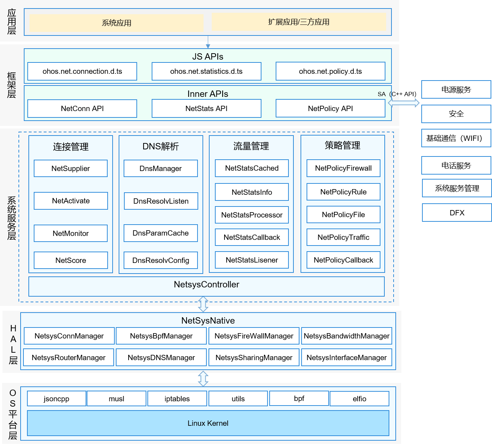

# Net Manager

## 简介

网络管理主要分为网络管理、策略管理、流量管理、网络共享、VPN管理以及以太网连接等模块，其中网络管理、策略管理、流量管理为基础服务，归档在netmanager_base仓，以太网连接、网络共享、VPN管理三个模块为可裁剪扩展模块，归档在netmanager_ext仓，netmanager_ext编译构建依赖netmanager_base库内容。如图1：网络管理架构图；

**图 1**  网络管理架构图



## 目录

```
foundation/communication/netmanager_base/
├─figures                     # 架构图
├─frameworks                  # 接口实现
│  ├─js                       # JS接口
│  └─native                   # native接口
├─interfaces                  # 接口定义
│  ├─innerkits                # native接口
│  └─kits                     # JS接口
├─sa_profile                  # sa定义
├─services                    # IPC服务端实现
│  ├─common                   # 公用代码存放目录
│  ├─etc                      # 进程配置文件目录
│  ├─netconnmanager           # 网络管理核心代码目录
│  ├─netmanagernative         # 网络子系统服务端代码
│  ├─netpolicymanager         # 策略管理核心代码目录
│  ├─netstatsmanager          # 流量管理核心代码目录
│  ├─netsys_bpf_stats         # bpfReader为service提供功能接口目录
│  └─netsyscontroller         # netsys客户端代码目录
├─test                        # 测试代码
│  ├─fuzztest                 # FUZZ测试目录
│  ├─netconnmanager           # 网络管理单元测试目录
│  ├─netmanagernative         # 网络子系统服务端单元测试目录
│  ├─netpolicymanager         # 策略管理单元测试目录
│  ├─netstatsmanager          # 流量统计单元测试目录
│  └─netsys_bpf_stats         # bpfReader单元测试目录
└─utils                       # 公共功能
   ├─common_utils             # 共同库目录
   ├─log                      # 日志实现目录
   └─napi_utils               # 公用NAPI代码目录
```

## 约束

-    开发语言：C++ JS

## 接口说明

| 类型 | 接口 | 功能说明 |
| ---- | ---- | ---- |
| ohos.net.connection | function getDefaultNet(callback: AsyncCallback\<NetHandle>): void; |获取一个含有默认网络的netId的NetHandle对象，使用callback回调 |
| ohos.net.connection | function getDefaultNet(): Promise\<NetHandle>; |获取一个含有默认网络的netId的NetHandle对象，使用Promise回调 |
| ohos.net.connection | function getAllNets(callback: AsyncCallback\<Array\<NetHandle>>): void;| 获取所处于连接状态的网络的MetHandle对象列表，使用callback回调 |
| ohos.net.connection | function getAllNets(): Promise\<Array\<NetHandle>>;| 获取所有处于连接状态的网络的NetHandle对象列表，使用Promise回调 |
| ohos.net.connection | function getConnectionProperties(netHandle: NetHandle, callback: AsyncCallback\<ConnectionProperties>): void; |查询默认网络的链路信息，使用callback回调 |
| ohos.net.connection | function getConnectionProperties(netHandle: NetHandle): Promise\<ConnectionProperties>; |查询默认网络的链路信息，使用Promise回调 |
| ohos.net.connection | function getNetCapabilities(netHandle: NetHandle, callback: AsyncCallback\<NetCapabilities>): void; |查询默认网络的能力集信息，使用callback回调 |
| ohos.net.connection | function getNetCapabilities(netHandle: NetHandle): Promise\<NetCapabilities>; |查询默认网络的能力集信息，使用Promise回调 |
| ohos.net.connection | function hasDefaultNet(callback: AsyncCallback\<boolean>): void; |查询是否有默认网络，使用callback回调 |
| ohos.net.connection | function hasDefaultNet(): Promise\<boolean>; |查询是否有默认网络，使用Promise回调 |
| ohos.net.connection | function getAddressesByName(host: string, callback: AsyncCallback\<Array\<NetAddress>>): void; |使用对应网络解析域名，获取所有IP，使用callback回调 |
| ohos.net.connection | function getAddressesByName(host: string): Promise\<Array\<NetAddress>>; |使用默认网络解析域名，获取所有IP，使用Promise回调 |
| ohos.net.connection | function createNetConnection(netSpecifier?: NetSpecifier, timeout?: number): NetConnection; | 返回一个NetConnection对象，netSpecifier指定关注的网络的各项特征，timeout是超时时间(单位是毫秒)，netSpecifier是timeout的必要条件，两者都没有则表示关注默认网络 |
| ohos.net.connection | function enableAirplaneMode(callback: AsyncCallback\<void>): void; | 设置网络为飞行模式，使用callback回调 |
| ohos.net.connection | function enableAirplaneMode(): Promise\<void>;|设置网络为飞行模式，使用Promise回调 |
| ohos.net.connection | function disableAirplaneMode(callback: AsyncCallback\<void>): void;| 关闭网络飞行模式，使用callback回调 |
| ohos.net.connection | function disableAirplaneMode(): Promise\<void>;| 关闭网络飞行模式，使用Promise回调 |
| ohos.net.connection | function reportNetConnected(netHandle: NetHandle, callback: AsyncCallback\<void>): void;| 向网络管理报告网络处于可用状态，调用此接口说明应用程序认为网络的可用性（ohos.net.connection.NetCap.NET_CAPABILITY_VAILDATED）与网络管理不一致。使用callback回调 |
| ohos.net.connection | function reportNetConnected(netHandle: NetHandle): Promise\<void>;| 向网络管理报告网络处于可用状态，调用此接口说明应用程序认为网络的可用性（ohos.net.connection.NetCap.NET_CAPABILITY_VAILDATED）与网络管理不一致。使用Promise回调 |
| ohos.net.connection | function reportNetDisconnected(netHandle: NetHandle, callback: AsyncCallback\<void>): void;| 向网络管理报告网络处于不可用状态，调用此接口说明应用程序认为网络的可用性（ohos.net.connection.NetCap.NET_CAPABILITY_VAILDATED）与网络管理不一致。使用callback回调 |
| ohos.net.connection | function reportNetDisconnected(netHandle: NetHandle): Promise\<void>;| 向网络管理报告网络处于不可用状态，调用此接口说明应用程序认为网络的可用性（ohos.net.connection.NetCap.NET_CAPABILITY_VAILDATED）与网络管理不一致。使用Promise回调 |
| ohos.net.connection.NetHandle | bindSocket(socketParam: TCPSocket \| UDPSocket, callback: AsyncCallback\<void>): void; | 将TCPSocket或UDPSockett绑定到当前网络，使用callback回调 |
| ohos.net.connection.NetHandle | bindSocket(socketParam: TCPSocket \| UDPSocket): Promise\<void>;| 将TCPSocket或UDPSockett绑定到当前网络，使用Promise回调 |
| ohos.net.connection.NetHandle | getAddressesByName(host: string, callback: AsyncCallback\<Array\<NetAddress>>): void; |使用默认网络解析域名，获取所有IP，使用callback回调 |
| ohos.net.connection.NetHandle | getAddressesByName(host: string): Promise\<Array\<NetAddress>>; |使用对应网络解析域名，获取所有IP，使用Promise回调 |
| ohos.net.connection.NetHandle | getAddressByName(host: string, callback: AsyncCallback\<NetAddress>): void; |使用对应网络解析域名，获取一个IP，调用callbac |
| ohos.net.connection.NetHandle | getAddressByName(host: string): Promise\<NetAddress>; |使用对应网络解析域名，获取一个IP，使用Promise回调 |
| ohos.net.connection.NetConnection | on(type: 'netAvailable', callback: Callback\<NetHandle>): void; |监听收到网络可用的事件 |
| ohos.net.connection.NetConnection | on(type: 'netCapabilitiesChange', callback: Callback\<{ netHandle: NetHandle, netCap: NetCapabilities }>): void; |监听网络能力变化的事件 |
| ohos.net.connection.NetConnection | on(type: 'netConnectionPropertiesChange', callback: Callback\<{ netHandle: NetHandle, connectionProperties: ConnectionProperties }>): void; |监听网络连接信息变化的事件 |
| ohos.net.connection.NetConnection | on(type: 'netLost', callback: Callback\<NetHandle>): void; |监听网络丢失的事件 |
| ohos.net.connection.NetConnection | on(type: 'netUnavailable', callback: Callback\<void>): void; |监听网络不可用的事件 |
| ohos.net.connection.NetConnection | register(callback: AsyncCallback\<void>): void; |注册默认网络或者createNetConnection中指定的网络的监听 |
| ohos.net.connection.NetConnection | unregister(callback: AsyncCallback\<void>): void; |注销默认网络或者createNetConnection中指定的网络的监听 |
| @ohos.net.policy | function setBackgroundPolicy(allow: boolean, callback: AsyncCallback\<void>): void; | 设置后台网络策略，callback为回调函数 |
| @ohos.net.policy | function setBackgroundPolicy(allow: boolean): Promise\<void>; | 设置后台网络策略 |
| @ohos.net.policy | function getBackgroundPolicy(callback: AsyncCallback\<NetBackgroundPolicy>): void; | 获取后台网络限制策略，callback为回调函数 |
| @ohos.net.policy | function getBackgroundPolicy(): Promise\<NetBackgroundPolicy>; | 获取后台网络限制策略 |
| @ohos.net.policy | function setPolicyByUid(uid: number, policy: NetUidPolicy, callback: AsyncCallback\<void>): void; | 设置对应uid应用的访问计量网络的策略，callback为回调函数 |
| @ohos.net.policy | function setPolicyByUid(uid: number, policy: NetUidPolicy): Promise\<void>; | 设置对应uid应用的访问计量网络的策略 |
| @ohos.net.policy | function getPolicyByUid(uid: number, callback: AsyncCallback\<NetUidPolicy>): void; | 通过应用uid获取策略，callback为回调函数 |
| @ohos.net.policy | function getPolicyByUid(uid: number): Promise\<NetUidPolicy>; | 通过应用uid获取策略 |
| @ohos.net.policy | function getUidsByPolicy(policy: NetUidPolicy, callback: AsyncCallback\<Array\<number>>): void; | 通过策略获取设置这一策略的应用uid数组，callback为回调函数 |
| @ohos.net.policy | function getUidsByPolicy(policy: NetUidPolicy): Promise\<Array\<number>>; | 通过策略获取设置这一策略的应用uid数组 |
| @ohos.net.policy | function getNetQuotaPolicies(callback: AsyncCallback\<Array\<NetQuotaPolicy>>): void; | 获取计量网络策略，callback为回调函数 |
| @ohos.net.policy | function getNetQuotaPolicies(): Promise\<Array\<NetQuotaPolicy>>; | 获取计量网络策略 |
| @ohos.net.policy | function setNetQuotaPolicies(quotaPolicies: Array\<NetQuotaPolicy>, callback: AsyncCallback\<void>): void; | 设置计量网络策略，callback为回调函数 |
| @ohos.net.policy | function setNetQuotaPolicies(quotaPolicies: Array\<NetQuotaPolicy>): Promise\<void>; | 设置计量网络策略 |
| @ohos.net.policy | function restoreAllPolicies(simId: string, callback: AsyncCallback\<void>): void; | 重置对应sim卡id的蜂窝网络、后台网络策略、防火墙策略、应用对应的策略，callback为回调函数 |
| @ohos.net.policy | function restoreAllPolicies(simId: string): Promise\<void>; | 重置对应sim卡id的蜂窝网络、后台网络策略、防火墙策略、应用对应的策略 |
| @ohos.net.policy | function isUidNetAllowedIsMetered(uid: number, isMetered: boolean, callback: AsyncCallback\<boolean>): void; | 获取对应uid能否访问计量或非计量网络，callback为回调函数 |
| @ohos.net.policy | function isUidNetAllowedIsMetered(uid: number, isMetered: boolean): Promise\<boolean>; | 获取对应uid能否访问计量或非计量网络 |
| @ohos.net.policy | function isUidNetAllowedIface(uid: number, iface: string, callback: AsyncCallback\<boolean>): void; | 获取对应uid能否访问指定的iface的网络，callback为回调函数 |
| @ohos.net.policy | function isUidNetAllowedIface(uid: number, iface: string): Promise\<boolean>; | 获取对应uid能否访问指定的iface的网络 |
| @ohos.net.policy | function setDeviceIdleAllowlist(uid: number, isAllow: boolean, callback: AsyncCallback\<void>): void | 设置指定uid能应用是否在休眠防火墙的白名单，callback为回调函数 |
| @ohos.net.policy | function setDeviceIdleAllowlist(uid: number, isAllow: boolean): Promise\<void>; | 设置指定uid能应用是否在休眠防火墙的白名单 |
| @ohos.net.policy | function getDeviceIdleAllowlist(callback: AsyncCallback\<Array\<number>>): void | 获取休眠模式白名单所包含的uid数组，callback为回调函数 |
| @ohos.net.policy | function getDeviceIdleAllowlist(): Promise\<Array\<number>>; | 获取休眠模式白名单所包含的uid数组 |
| @ohos.net.policy | function getBackgroundPolicyByUid(uid: number, callback: AsyncCallback\<NetBackgroundPolicy>): void | 获取指定uid能否访问后台网络，callback为回调函数 |
| @ohos.net.policy | function getBackgroundPolicyByUid(uid: number): Promise\<NetBackgroundPolicy>; | 获取指定uid能否访问后台网络 |
| @ohos.net.policy | function resetPolicies(simId: string, callback: AsyncCallback\<void>): void; | 重置对应sim卡id的蜂窝网络、后台网络策略、防火墙策略、应用对应的策略，callback为回调函数 |
| @ohos.net.policy | function resetPolicies(simId: string): Promise\<void>; | 重置对应sim卡id的蜂窝网络、后台网络策略、防火墙策略、应用对应的策略 |
| @ohos.net.policy | function updateRemindPolicy(netType: NetBearType, simId: string, remindType: RemindType, callback: AsyncCallback\<void>): void | 更新提醒策略，netType为网络类型，simId为SIM卡id， remindType为提醒类型。callback为回调函数|
| @ohos.net.policy | function updateRemindPolicy(netType: NetBearType, simId: string, remindType: RemindType): Promise\<void>; | 更新提醒策略，netType为网络类型，simId为SIM卡id， remindType为提醒类型 |
| @ohos.net.policy | function on(type: 'netUidPolicyChange', callback: Callback\<{ uid: number, policy: NetUidPolicy }>): void; | 注册policy发生改变时的回调 |
| @ohos.net.policy | function off(type: 'netUidPolicyChange', callback: Callback\<void>): void; | 反注册policy发生改变时的回调 |
| @ohos.net.policy | function on(type: "netUidRuleChange", callback: Callback\<{ uid: number, rule: NetUidRule }>): void; | 注册rule发生改变时的回调 |
| @ohos.net.policy | function off(type: "netUidRuleChange", callback: Callback\<void>): void; | 反注册rule发生改变时的回调 |
| @ohos.net.policy | function on(type: "netMeteredIfacesChange", callback: Callback\<Array\<string>>): void; | 注册计量iface发生改变时的回调 |
| @ohos.net.policy | function off(type: "netMeteredIfacesChange", callback: Callback\<void>): void; | 反注册计量iface发生改变时的回调 |
| @ohos.net.policy | function on(type: "netQuotaPolicyChange", callback: Callback\<Array\<NetQuotaPolicy>>): void; | 注册计量网络策略发生改变时的回调 |
| @ohos.net.policy | function off(type: "netQuotaPolicyChange", callback: Callback\<void>): void; | 反注册计量网络策略发生改变时的回调 |
| @ohos.net.policy | function on(type: "netBackgroundPolicyChange", callback: Callback\<boolean>): void; | 注册后台网络策略发生改变时的回调 |
| @ohos.net.policy | function off(type: "netBackgroundPolicyChange", callback: Callback\<void>): void; | 反注册后台网络策略发生改变时的回调 |
| ohos.net.statistics | function getIfaceRxBytes(nic: string, callback: AsyncCallback\<number>): void; |查询指定网卡的下行流量数据，使用callback回调|
| ohos.net.statistics | function getIfaceRxBytes(nic: string): Promise\<number>; |获取指定网卡的下行流量数据，使用Promise回调 |
| ohos.net.statistics | function getIfaceTxBytes(nic: string, callback: AsyncCallback\<number>): void; |查询指定网卡的上行流量数据，使用callback回调 |
| ohos.net.statistics | function getIfaceRxBytes(nic: string): Promise\<number>; |获取指定网卡的上行流量数据，使用Promise回调 |
| ohos.net.statistics | function getCellularRxBytes(callback: AsyncCallback\<number>): void; |查询指蜂窝网的下行流量数据，使用callback回调 |
| ohos.net.statistics | function getCellularRxBytes(): Promise\<number>; |查询指蜂窝网的下行流量数据，使用Promise回调 |
| ohos.net.statistics | function getCellularTxBytes(callback: AsyncCallback\<number>): void; |查询蜂窝网的上行流量数据，使用callback回调 |
| ohos.net.statistics | function getCellularTxBytes(): Promise\<number>; |查询蜂窝网的上行流量数据，使用Promise回调 |
| ohos.net.statistics | function getAllRxBytes(callback: AsyncCallback\<number>): void; |查询所有网卡的下行流量数据，使用callback回调 |
| ohos.net.statistics | function getAllRxBytes(): Promise\<number>; |查询所有网卡的下行流量数据，使用Promise回调 |
| ohos.net.statistics | function getAllTxBytes(callback: AsyncCallback\<number>): void; |查询所有网卡的上行流量数据，使用callback回调 |
| ohos.net.statistics | function getAllTxBytes(): Promise\<number>; |查询所有网卡的上行流量数据，使用Promise回调 |
| ohos.net.statistics | function getUidRxBytes(uid: number, callback: AsyncCallback\<number>): void; |查询指定应用的下行流量数据，使用callback回调 |
| ohos.net.statistics | function getUidRxBytes(uid: number): Promise\<number>; |查询指定应用的下行流量数据，使用Promise回调 |
| ohos.net.statistics | function getUidTxBytes(uid: number, callback: AsyncCallback\<number>): void; |查询指定应用的上行流量数据，使用callback回调 |
| ohos.net.statistics | function getUidTxBytes(uid: number): Promise\<number>; |查询指定应用的上行流量数据，使用Promise回调 |

完整的JS API说明以及实例代码请参考：[网络管理](https://gitee.com/openharmony/docs/blob/master/zh-cn/application-dev/reference/apis/js-apis-net-connection.md)。

## 接口使用说明

### 注册默认网络或者createNetConnection中指定的网络的监听

* 示例
  ```javascript
  import connection from '@ohos.net.connection'
  ```
  ```javascript
  let connection = connection.createNetConnection()
  connection.on('netAvailable', function(data) {
    console.log(JSON.stringify(data))
  })
  connection.register(function (error) {
    if (error) {
      console.log(JSON.stringify(error))
    }
  })
  ```

### 获取所有注册的网络

* 示例
  ```javascript
  import connection from '@ohos.net.connection'
  ```
  ```javascript
  connection.getAllNets((err, data) => {
      this.callBack(err, data);
      if (data) {
          this.netList = data;
      }
  })
  ```

### 查询默认网络的链路信息

* 示例
  ```javascript
  import connection from '@ohos.net.connection'
  ```
  ```javascript
  connection.getConnectionProperties(this.netHandle, (err, data) => {
      this.callBack(err, data);
  })
  ```

### 使用对应网络解析域名，获取所有IP

* 示例
  ```javascript
  import connection from '@ohos.net.connection'
  ```
  ```javascript
  connection.getAddressesByName(this.host, (err, data) => {
      this.callBack(err, data);
  })
  ```

### 设置后台网络策略

* 示例

  ```javascript
  import policy from '@ohos.net.policy'
  ```

  ```javascript
  policy.setBackgroundPolicy(Boolean(Number.parseInt(this.isBoolean)), (err, data) => {
      this.callBack(err, data);
  })
  ```

### 获取后台网络限制策略

* 示例

  ```javascript
  import policy from '@ohos.net.policy'
  ```
  ```javascript
  policy.getBackgroundPolicy((err, data) => {
      this.callBack(err, data);
  })
  ```

### 设置对应uid应用的访问计量网络的策略

* 示例

  ```javascript
  import policy from '@ohos.net.policy'
  ```
  ```javascript
  policy.setPolicyByUid(Number.parseInt(this.firstParam), Number.parseInt(this.currentNetUidPolicy), (err, data) => {
      this.callBack(err, data);
  })
  ```

### 设置指定uid能应用是否在休眠防火墙的白名单

* 示例

  ```javascript
  import policy from '@ohos.net.policy'
  ```

  ```javascript
  policy.setDeviceIdleAllowList(Number.parseInt(this.firstParam), Boolean(Number.parseInt(this.isBoolean)), (err, data) => {
      this.callBack(err, data);
  })

### 查询指定网卡的下行流量数据，以Promise的方式异步返回执行结果。

* 示例
  ```javascript
  import statistics from '@ohos.net.statistics'
  ```
  ```javascript
  statistics.getIfaceRxBytes("wlan0").then(function (addresses) {
    console.log(JSON.stringify(addresses))
  })
  ```

### 查询指定网卡的上行流量数据，以Promise的方式异步返回执行结果。。

* 示例
  ```javascript
  import statistics from '@ohos.net.statistics'
  ```
  ```javascript
  statistics.getIfaceTxBytes("wlan0").then(function (addresses) {
    console.log(JSON.stringify(addresses))
  })
  ```

## 相关仓

[网络管理子系统](https://gitee.com/openharmony/docs/blob/master/zh-cn/readme/%E7%BD%91%E7%BB%9C%E7%AE%A1%E7%90%86%E5%AD%90%E7%B3%BB%E7%BB%9F.md)

**communication_netmanager_base**

[communication_netmanager_ext](https://gitee.com/openharmony/communication_netmanager_ext)

[communication_netstack](https://gitee.com/openharmony/communication_netstack)
