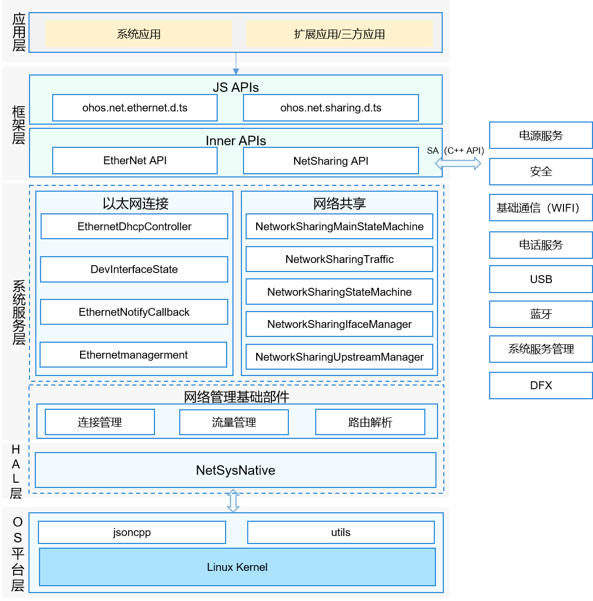

# Net Manager<a name="EN-US_TOPIC_0000001105058232"></a>

-    [简介](#简介)
-    [目录](#目录)
-    [约束](#约束)
-    [接口说明](#接口说明)
-    [使用说明](#使用说明)
-    [相关仓](#相关仓)


## 简介

网络管理介绍：

​    网络管理主要分为连接管理、策略管理、流量管理、网络共享、VPN管理以及以太网连接等模块，其中连接管理、策略管理、流量管理为基础服务，归档在netmanager_base仓，以太网连接、网络共享、VPN管理三个模块为可裁剪扩展模块，归档在netmanager_ext仓，netmanager_ext编译构建依赖netmanager_base库内容。如图1：网络管理架构图；

**图 1**  网络管理架构图



## 目录

```
foundation/communication/netmanager_ext/
├─figures                            #README用于的png图片
├─frameworks                         #框架层目录
│  ├─js                              #js接口实现
│  └─native                          #C++接口实现
├─interfaces                         #C++接口头文件
│  ├─innerkits                       #部件间的内部接口
│  └─kits                            #对应用提供的接口（例如JS接口）
├─sa_profile                         #SA服务配置文件
├─services                           #C++内部实现
│  ├─ethernetmanager                 #以太网模块
│  └─networksharemanager             #网络共享模块
├─test                               #单元测试代码
│  ├─ethernetmanager                 #以太网模块单元测试
│  └─networkshare                    #网络共享模块单元测试
└─utils                              #核心服务工具代码目录
   ├─event_report                    #核心服务事件工具目录
   └─log                             #核心服务日志工具目录
```

## 约束

-    开发语言：C++ JS

## 接口说明

| 类型 | 接口 | 功能说明 |
| ---- | ---- | ---- |
| ohos.net.ethernet | function setIfaceConfig\(iface: string, ic: InterfaceConfiguration, callback: AsyncCallback<void\>\): void; |设置网络接口配置信息，调用callback |
| ohos.net.ethernet | function setIfaceConfig\(iface: string, ic: InterfaceConfiguration\): Promise<void\>; |设置网络接口配置信息，返回Promise |
| ohos.net.ethernet | function getIfaceConfig\(iface: string, callback: AsyncCallback<InterfaceConfiguration\>\): void; |获取网络接口配置信息，调用callback |
| ohos.net.ethernet | function getIfaceConfig\(iface: string\): Promise<InterfaceConfiguration\>; |获取网络接口配置信息，返回Promise |
| ohos.net.ethernet | function isIfaceActive\(iface?: string, callback: AsyncCallback<number\>\): void; |判断接口是否已激活，调用callback |
| ohos.net.ethernet | function isIfaceActive\(iface?: string\): Promise<number\>; |判断接口是否已激活，返回Promise |
| ohos.net.ethernet | function getAllActiveIfaces\(callback: AsyncCallback<Array\<string\>\>\): void; |获取活动的网络接口，调用callback |
| ohos.net.ethernet | function getAllActiveIfaces\(\): Promise<Array\<string\>\>; |获取活动的网络接口，返回Promise |
| ohos.net.sharing | function isSharingSupported(callback: AsyncCallback\<boolean>): void; | 获取当前系统是否支持网络共享，调用callback |
| ohos.net.sharing | function isSharingSupported(): Promise\<boolean>; | 获取当前系统是否支持网络共享，返回promise |
| ohos.net.sharing | function isSharing(callback: AsyncCallback\<boolean>): void; | 获取当前共享状态，调用callback |
| ohos.net.sharing | function isSharing(): Promise\<boolean>; | 获取当前共享状态，返回promise |
| ohos.net.sharing | function startSharing(type: SharingIfaceType, callback: AsyncCallback\<void>): void; | 开启共享，type为共享类型，目前支持Wifi热点、蓝牙、USB，调用callback |
| ohos.net.sharing | function startSharing(type: SharingIfaceType): Promise\<void>; | 开启共享，type为共享类型，目前支持Wifi热点、蓝牙、USB，返回promise |
| ohos.net.sharing | function stopSharing(type: SharingIfaceType, callback: AsyncCallback\<void>): void; | 停止指定类型共享，type为共享类型，包括Wifi热点、蓝牙、USB，调用callback |
| ohos.net.sharing | function stopSharing(type: SharingIfaceType): Promise\<void>; | 停止指定类型共享，type为共享类型，包括Wifi热点、蓝牙、USB，返回promise |
| ohos.net.sharing | function getStatsRxBytes(callback: AsyncCallback\<number>): void; | 获取共享接收数据量，单位KB，调用callback |
| ohos.net.sharing | function getStatsRxBytes(): Promise\<number>; | 获取共享接收数据量，单位KB，返回promise |
| ohos.net.sharing | function getStatsTxBytes(callback: AsyncCallback\<number>): void; | 获取共享发送数据量，单位KB，调用callback |
| ohos.net.sharing | function getStatsTxBytes(): Promise\<number>; | 获取共享发送数据量，单位KB，返回promise |
| ohos.net.sharing | function getStatsTotalBytes(callback: AsyncCallback\<number>): void; | 获取共享总数据流量，单位KB，调用callback |
| ohos.net.sharing | function getStatsTotalBytes(): Promise\<number>; | 获取共享总数据流量，单位KB，返回promise |
| ohos.net.sharing | function getSharingIfaces(state: SharingIfaceState, callback: AsyncCallback\<Array\<string>>): void; | 获取指定状态的网卡名称，state为状态，包括正在共享、可共享、共享错误，调用callback |
| ohos.net.sharing | function getSharingIfaces(state: SharingIfaceState): Promise\<Array\<string>>; | 获取指定状态的网卡名称，state为状态，包括正在共享、可共享、共享错误，返回promise |
| ohos.net.sharing | function getSharingState(type: SharingIfaceType, callback: AsyncCallback\<SharingIfaceState>): void; | 获取指定类型共享状态，type为类型，目前支持Wifi热点、蓝牙、USB，调用callback |
| ohos.net.sharing | function getSharingState(type: SharingIfaceType): Promise\<SharingIfaceState>; | 获取指定类型共享状态，type为类型，目前支持Wifi热点、蓝牙、USB，返回promise |
| ohos.net.sharing | function getSharableRegexes(type: SharingIfaceType, callback: AsyncCallback\<Array\<string>>): void; | 获取与指定类型匹配的网卡正则表达式列表，type为类型，目前支持Wifi热点、蓝牙、USB，调用callback |
| ohos.net.sharing | function getSharableRegexes(type: SharingIfaceType): Promise\<Array\<string>>; | 获取与指定类型匹配的网卡正则表达式列表，type为类型，目前支持Wifi热点、蓝牙、USB，返回promise |
| ohos.net.sharing | function on(type: 'sharingStateChange', callback: Callback\<boolean>): void; | 注册共享状态改变监听 |
| ohos.net.sharing | function off(type: 'sharingStateChange', callback?: Callback\<boolean>): void; | 注销共享状态改变监听 |
| ohos.net.sharing | unction on(type: 'interfaceSharingStateChange', callback: Callback\<{ type: SharingIfaceType, iface: string, state: SharingIfaceState }>): void; | 注册指定网卡共享状态改变监听 |
| ohos.net.sharing | function off(type: 'interfaceSharingStateChange', callback?: Callback\<{ type: SharingIfaceType, iface: string, state: SharingIfaceState }>): void; | 注销指定网卡共享状态改变监听 |
| ohos.net.sharing | function on(type: 'sharingUpstreamChange', callback: Callback\<NetHandle>): void; | 注册上行网卡改变监听 |
| ohos.net.sharing | function off(type: 'sharingUpstreamChange', callback?: Callback\<NetHandle>): void; | 注销上行网卡改变监听 |

## 接口使用说明

### 设置网络接口配置信息

* 示例
  ```javascript
  import ethernet from '@ohos.net.ethernet'
  ```
  ```javascript
  ethernet.setIfaceConfig("eth0", {mode:ethernet.STATIC,ipAddr:"192.168.1.123", routeAddr:"192.168.1.1",
      gateAddr:"192.168.1.1", maskAddr:"255.255.255.0", dnsAddr0:"1.1.1.1", dnsAddr1:"2.2.2.2"},
      (error) => {
          if (error) {
              console.log("setIfaceConfig callback error = " + error);
          } else {
              console.log("setIfaceConfig callback ok ");
          }
      });
  ```

### 获取网络接口配置信息

* 示例
  ```javascript
  import ethernet from '@ohos.net.ethernet'
  ```
  ```javascript
  ethernet.getIfaceConfig("eth0", (error, value) => {
      if (error) {
          console.log("getIfaceConfig  callback error = " + error);
      } else {
          console.log("getIfaceConfig callback mode = " + value.mode);
          console.log("getIfaceConfig callback ipAddr = " + value.ipAddr);
          console.log("getIfaceConfig callback routeAddr = " + value.routeAddr);
          console.log("getIfaceConfig callback gateAddr = " + value.gateAddr);
          console.log("getIfaceConfig callback maskAddr = " + value.maskAddr);
          console.log("getIfaceConfig callback dns0Addr = " + value.dns0Addr);
          console.log("getIfaceConfig callback dns1Addr = " + value.dns1Addr);
      }
  });
  ```

### 开始网络共享

* 示例
  ```javascript
  import sharing from '@ohos.net.sharing'
  ```
  ```javascript
  sharing.startSharing(this.sharingType,(err)=>{
      this.callBack(err);
  })
  ```

### 停止网络共享

* 示例
  ```javascript
  import sharing from '@ohos.net.sharing'
  ```
  ```javascript
  sharing.stopSharing(this.sharingType,(err)=>{
      this.callBack(err);
  })
  ```

## 相关仓

[网络管理子系统](https://gitee.com/openharmony/docs/blob/master/zh-cn/readme/%E7%BD%91%E7%BB%9C%E7%AE%A1%E7%90%86%E5%AD%90%E7%B3%BB%E7%BB%9F.md)

**communication_netmanager_ext**

[communication_netmanager_base](https://gitee.com/openharmony/communication_netmanager_base)

[communication_netstack](https://gitee.com/openharmony/communication_netstack)
