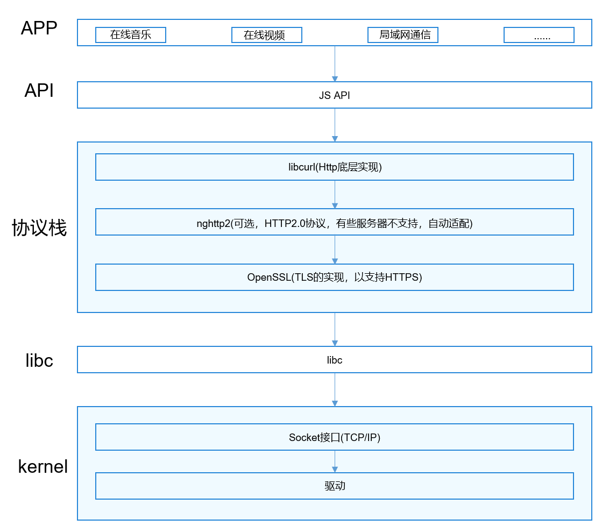
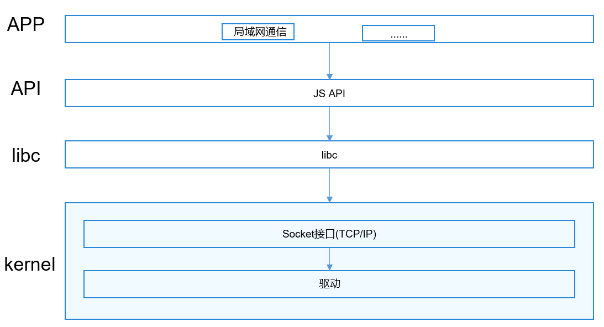

# Net Stack

## 简介

网络协议栈介绍：

    网络协议栈模块作为电话子系统可裁剪部件，主要分为HTTP和socket模块；如图1：Http接口架构图；如图2：socket接口架构图；

**图 1**  Http接口架构图



**图 2**  socket接口架构图



## 目录

```
/foundation/communication/netstack
├─figures                            # 架构图
├─frameworks                         # 接口实现
│  ├─js                              # JS API实现
│  │   ├─builtin                     # 小型系统JS API实现
│  │   │   ├── http_request          # http请求实现目录
│  │   │   └── test                  # 测试代码
│  │   └─napi                        # 标准系统JS API实现
│  │       ├─fetch                   # fetch API
│  │       ├─http                    # http API
│  │       ├─socket                  # socket API
│  │       ├─tls                     # tls socket API
│  │       └─websocket               # websocket API
│  └─native                          # native接口
│    └─tls_socket                    # tls socket native实现
├─interfaces                         # 接口定义
│  ├─innerkits                       # native接口
│  │  └─tls_socket                   # tls socket native接口
│  └─kits                            # JS接口
│     └─js                           # 本地.d.ts文件
├─test                               # 测试代码目录
└─utils                              # 公共功能
   ├─common_utils                    # 共通库目录
   ├─log                             # 日志实现目录
   └─napi_utils                      # 公用NAPI代码目录
```

## 接口说明

### Http接口说明

| 类型 | 接口 | 功能说明 |
| ---- | ---- | ---- |
| ohos.net.socket | function createHttp(): HttpRequest | 返回一个HttpRequest对象 |
| ohos.net.http.HttpRequest | on(type: "headerReceive", callback: AsyncCallback\<Object>): void | 监听收到Http头的事件 |
| ohos.net.http.HttpRequest | once(type: "headerReceive", callback: Callback\<Object>): void | 监听收到Http头的事件，只监听一次 |
| ohos.net.http.HttpRequest | off(type: "headerReceive", callback: AsyncCallback\<Object>): void | 取消监听收到Http头的事件 |
| ohos.net.http.HttpRequest | on(type: "headerReceive", callback: Callback\<Object>): void | 监听收到Http头的事件 |
| ohos.net.http.HttpRequest | once(type: "headerReceive", callback: Callback\<Object>): void | 监听收到Http头的事件，只监听一次 |
| ohos.net.http.HttpRequest | off(type: "headerReceive", callback: Callback\<Object>): void | 取消监听收到Http头的事件 |
| ohos.net.http.HttpRequest | request(url: string, callback: AsyncCallback\<[HttpResponse](#httpresponse)>): void | 用**GET**方法请求一个域名，调用callback |
| ohos.net.http.HttpRequest | request(url: string, options: [HttpRequestOptions](#httprequestoptions), callback: AsyncCallback\<[HttpResponse](#httpresponse)>): void | 请求一个域名，options中携带请求参数，调用callback |
| ohos.net.http.HttpRequest | request(url: string, options?: [HttpRequestOptions](#httprequestoptions): Promise\<[HttpResponse](#httpresponse)> | 请求一个域名，options中携带请求参数(可选)，返回Promise |

#### HttpRequestOptions

发起请求可选参数的类型和取值范围。

| 参数           | 类型                                 | 必填 | 说明                                                       |
| -------------- | ------------------------------------ | ---- | ---------------------------------------------------------- |
| method         | [RequestMethod](#requestmethod) | 否   | 请求方式。                                                 |
| extraData      | string &#124; Object &#124; ArrayBuffer<sup>8+</sup> | 否   | 发送请求的额外数据。<br />- 当HTTP请求为POST、PUT等方法时，此字段为HTTP请求的content，支持类型为string和ArrayBuffer<sup>8+</sup>。<br />- 当HTTP请求为GET、OPTIONS、DELETE、TRACE、CONNECT等方法时，此字段为HTTP请求的参数补充，参数内容会拼接到URL中进行发送，支持类型为string和Object。<br />- 开发者传入string对象，开发者需要自行编码，将编码后的string传入。<sup>8+</sup> |
| header         | Object                               | 否   | HTTP请求头字段。默认{'Content-Type': 'application/json'}。 |
| readTimeout    | number                               | 否   | 读取超时时间。单位为毫秒（ms），默认为60000ms。            |
| connectTimeout | number                               | 否   | 连接超时时间。单位为毫秒（ms），默认为60000ms。            |

#### RequestMethod

HTTP 请求方法。

| **method 的合法值** | 说明                |
| :------------------ | :------------------ |
| OPTIONS             | HTTP 请求 OPTIONS。 |
| GET                 | HTTP 请求 GET。     |
| HEAD                | HTTP 请求 HEAD。    |
| POST                | HTTP 请求 POST。    |
| PUT                 | HTTP 请求 PUT。     |
| DELETE              | HTTP 请求 DELETE。  |
| TRACE               | HTTP 请求 TRACE。   |
| CONNECT             | HTTP 请求 CONNECT。 |

#### ResponseCode

发起请求返回的响应码。

| 变量              | 值   | 说明                                                         |
| ----------------- | ---- | ------------------------------------------------------------ |
| OK                | 200  | 请求成功。一般用于GET与POST请求。                            |
| CREATED           | 201  | 已创建。成功请求并创建了新的资源。                           |
| ACCEPTED          | 202  | 已接受。已经接受请求，但未处理完成。                         |
| NOT_AUTHORITATIVE | 203  | 非授权信息。请求成功。                                       |
| NO_CONTENT        | 204  | 无内容。服务器成功处理，但未返回内容。                       |
| RESET             | 205  | 重置内容。                                                   |
| PARTIAL           | 206  | 部分内容。服务器成功处理了部分GET请求。                      |
| MULT_CHOICE       | 300  | 多种选择。                                                   |
| MOVED_PERM        | 301  | 永久移动。请求的资源已被永久的移动到新URI，返回信息会包括新的URI，浏览器会自动定向到新URI。 |
| MOVED_TEMP        | 302  | 临时移动。                                                   |
| SEE_OTHER         | 303  | 查看其它地址。                                               |
| NOT_MODIFIED      | 304  | 未修改。                                                     |
| USE_PROXY         | 305  | 使用代理。                                                   |
| BAD_REQUEST       | 400  | 客户端请求的语法错误，服务器无法理解。                       |
| UNAUTHORIZED      | 401  | 请求要求用户的身份认证。                                     |
| PAYMENT_REQUIRED  | 402  | 保留，将来使用。                                             |
| FORBIDDEN         | 403  | 服务器理解请求客户端的请求，但是拒绝执行此请求。             |
| NOT_FOUND         | 404  | 服务器无法根据客户端的请求找到资源（网页）。                 |
| BAD_METHOD        | 405  | 客户端请求中的方法被禁止。                                   |
| NOT_ACCEPTABLE    | 406  | 服务器无法根据客户端请求的内容特性完成请求。                 |
| PROXY_AUTH        | 407  | 请求要求代理的身份认证。                                     |
| CLIENT_TIMEOUT    | 408  | 请求时间过长，超时。                                         |
| CONFLICT          | 409  | 服务器完成客户端的PUT请求是可能返回此代码，服务器处理请求时发生了冲突。 |
| GONE              | 410  | 客户端请求的资源已经不存在。                                 |
| LENGTH_REQUIRED   | 411  | 服务器无法处理客户端发送的不带Content-Length的请求信息。     |
| PRECON_FAILED     | 412  | 客户端请求信息的先决条件错误。                               |
| ENTITY_TOO_LARGE  | 413  | 由于请求的实体过大，服务器无法处理，因此拒绝请求。           |
| REQ_TOO_LONG      | 414  | 请求的URI过长（URI通常为网址），服务器无法处理。             |
| UNSUPPORTED_TYPE  | 415  | 服务器无法处理请求的格式。                                   |
| INTERNAL_ERROR    | 500  | 服务器内部错误，无法完成请求。                               |
| NOT_IMPLEMENTED   | 501  | 服务器不支持请求的功能，无法完成请求。                       |
| BAD_GATEWAY       | 502  | 充当网关或代理的服务器，从远端服务器接收到了一个无效的请求。 |
| UNAVAILABLE       | 503  | 由于超载或系统维护，服务器暂时的无法处理客户端的请求。       |
| GATEWAY_TIMEOUT   | 504  | 充当网关或代理的服务器，未及时从远端服务器获取请求。         |
| VERSION           | 505  | 服务器请求的HTTP协议的版本。                                 |

#### HttpResponse

request方法回调函数的返回值类型。

| 参数名               | 类型                                         | 必填 | 说明                                                         |
| -------------------- | -------------------------------------------- | ---- | ------------------------------------------------------------ |
| result               | string &#124; Object &#124;ArrayBuffer<sup>8+</sup> | 是   | Http请求根据响应头中Content-type类型返回对应的响应格式内容：<br />- application/json：返回JSON格式的字符串，如需Http响应具体内容，需开发者自行解析<br />- application/octet-stream：ArrayBuffer<br />- 其他：string |
| responseCode         | [ResponseCode](#responsecode) &#124; number      | 是   | 回调函数执行成功时，此字段为[ResponseCode](#responsecode)。若执行失败，错误码将会从AsyncCallback中的err字段返回。错误码如下：<br />- 200：通用错误<br />- 202：参数错误<br />- 300：I/O错误 |
| header               | Object                                       | 是   | 发起http请求返回来的响应头。当前返回的是JSON格式字符串，如需具体字段内容，需开发者自行解析。常见字段及解析方式如下：<br/>- Content-Type：header['Content-Type']；<br />- Status-Line：header['Status-Line']；<br />- Date：header.Date/header['Date']；<br />- Server：header.Server/header['Server']； |
| cookies<sup>8+</sup> | string                                       | 是   | 服务器返回的 cookies。                                       |

#### 示例

```javascript
import http from "@ohos.net.http"
let httpRequest = http.createHttp()
httpRequest.request("www.example.com", function (err, data) {
    console.log(JSON.stringify(err))
    console.log(JSON.stringify(data))
})
```

### socket接口说明

| 类型 | 接口 | 功能说明 |
| ---- | ---- | ---- |
| ohos.net.socket | function constructUDPSocketInstance(): UDPSocket | 返回一个UDPSocket对象 |
| ohos.net.socket | function constructUDPSocketInstance(): TCPSocket | 返回一个TCPSocket对象 |
| ohos.net.socket | function constructTLSSocketInstance(): TLSSocket | 返回一个TLSSocket对象 |
| ohos.net.socket.UDPSocket | bind(address: [NetAddress](#netaddress), callback: AsyncCallback\<void>): void | 绑定IP地址和端口，端口可以指定或由系统随机分配。使用callback方式作为异步方法。 |
| ohos.net.socket.UDPSocket | bind(address: [NetAddress](#netaddress)): Promise\<void> | 绑定IP地址和端口，端口可以指定或由系统随机分配。使用Promise方式作为异步方法。 |
| ohos.net.socket.UDPSocket | send(options: [UDPSendOptions](#udpsendoptions), callback: AsyncCallback\<void>): void | 通过UDPSocket连接发送数据。使用callback方式作为异步方法。 |
| ohos.net.socket.UDPSocket | send(options: [UDPSendOptions](#udpsendoptions)): Promise\<void> | 通过UDPSocket连接发送数据。使用Promise方式作为异步方法。 |
| ohos.net.socket.UDPSocket | close(callback: AsyncCallback\<void>): void | 关闭UDPSocket连接。使用callback方式作为异步方法。 |
| ohos.net.socket.UDPSocket | close(): Promise\<void> | 关闭UDPSocket连接。使用Promise方式作为异步方法。 |
| ohos.net.socket.UDPSocket | getState(callback: AsyncCallback\<[SocketStateBase](#socketstatebase)>): void | 获取UDPSocket状态。使用callback方式作为异步方法。 |
| ohos.net.socket.UDPSocket | getState(): Promise\<[SocketStateBase](#socketstatebase)> | 获取UDPSocket状态。使用Promise方式作为异步方法。 |
| ohos.net.socket.UDPSocket | setExtraOptions(options: [UDPExtraOptions](#udpextraoptions), callback: AsyncCallback\<void>): void | 设置UDPSocket连接的其他属性。使用callback方式作为异步方法。 |
| ohos.net.socket.UDPSocket | setExtraOptions(options: [UDPExtraOptions](#udpextraoptions)): Promise\<void> | 设置UDPSocket连接的其他属性。使用Promise方式作为异步方法。 |
| ohos.net.socket.UDPSocket | on(type: 'message', callback: Callback\<{message: ArrayBuffer, remoteInfo: [SocketRemoteInfo](#socketremoteinfo)}>): void | 订阅UDPSocket连接的接收消息事件。使用callback方式作为异步方法。 |
| ohos.net.socket.UDPSocket | off(type: 'message', callback?: Callback\<{message: ArrayBuffer, remoteInfo: [SocketRemoteInfo](#socketremoteinfo)}>): void | 取消订阅UDPSocket连接的接收消息事件。使用callback方式作为异步方法。 |
| ohos.net.socket.UDPSocket | on(type: 'listening' &#124; 'close', callback: Callback\<void>): void | 订阅UDPSocket连接的数据包消息事件或关闭事件。使用callback方式作为异步方法。 |
| ohos.net.socket.UDPSocket | off(type: 'listening' &#124; 'close', callback?: Callback\<void>): void | 取消订阅UDPSocket连接的数据包消息事件或关闭事件。使用callback方式作为异步方法。 |
| ohos.net.socket.UDPSocket | on(type: 'error', callback?: ErrorCallback): void | 订阅UDPSocket连接的error事件。使用callback方式作为异步方法。 |
| ohos.net.socket.UDPSocket | off(type: 'error', callback?: ErrorCallback): void | 取消订阅UDPSocket连接的error事件。使用callback方式作为异步方法。 |
| ohos.net.socket.TCPSocket | bind(address: [NetAddress](#netaddress), callback: AsyncCallback\<void>): void | 绑定IP地址和端口，端口可以指定或由系统随机分配。使用callback方法作为异步方法。 |
| ohos.net.socket.TCPSocket | bind(address [NetAddress](#netaddress)): Promise\<void> | 绑定IP地址和端口，端口可以指定或由系统随机分配。使用Promise方法作为异步方法。 |
| ohos.net.socket.TCPSocket | connect(options: [TCPConnectOptions](#tcpconnectoptions), callback: AsyncCallback\<void>): void | 连接到指定的IP地址和端口。使用callback方法作为异步方法。 |
| ohos.net.socket.TCPSocket | connect(options: [TCPConnectOptions](#tcpconnectoptions)): Promise\<void> | 连接到指定的IP地址和端口。使用Promise方法作为异步方法。 |
| ohos.net.socket.TCPSocket | send(options: [TCPSendOptions](#tcpsendoptions), callback: AsyncCallback\<void>): void | 通过TCPSocket连接发送数据。使用callback方式作为异步方法。 |
| ohos.net.socket.TCPSocket | send(options: [TCPSendOptions](#tcpsendoptions)): Promise\<void> | 通过TCPSocket连接发送数据。使用Promise方式作为异步方法。 |
| ohos.net.socket.TCPSocket | close(callback: AsyncCallback\<void>): void | 关闭TCPSocket连接。使用Promise方式作为异步方法。 |
| ohos.net.socket.TCPSocket | close(): Promise\<void> | 关闭TCPSocket连接。使用Promise方式作为异步方法。 |
| ohos.net.socket.TCPSocket | getRemoteAddress(callback: AsyncCallback\<[NetAddress](#netaddress)>): void | 获取对端Socket地址。使用callback方式作为异步方法。 |
| ohos.net.socket.TCPSocket | getRemoteAddress(): Promise\<[NetAddress](#netaddress)> | 获取对端Socket地址。使用Promise方式作为异步方法。 |
| ohos.net.socket.TCPSocket | getState(callback: AsyncCallback\<[SocketStateBase](#socketstatebase)>): void | 获取TCPSocket状态。使用callback方式作为异步方法。 |
| ohos.net.socket.TCPSocket | getState(): Promise\<[SocketStateBase](#socketstatebase)> | 获取TCPSocket状态。使用Promise方式作为异步方法。 |
| ohos.net.socket.TCPSocket | setExtraOptions(options: [TCPExtraOptions](#tcpextraoptions), callback: AsyncCallback<void>): void | 设置TCPSocket连接的其他属性。使用callback方式作为异步方法。 |
| ohos.net.socket.TCPSocket | setExtraOptions(options: [TCPExtraOptions](#tcpextraoptions)): Promise<void> | 设置TCPSocket连接的其他属性。使用Promise方式作为异步方法。 |
| ohos.net.socket.TCPSocket | on(type: 'message', callback: Callback<{message: ArrayBuffer, remoteInfo: [SocketRemoteInfo](#socketremoteinfo)}>): void | 订阅TCPSocket连接的接收消息事件。使用callback方式作为异步方法。 |
| ohos.net.socket.TCPSocket | off(type: 'message', callback: Callback<{message: ArrayBuffer, remoteInfo: [SocketRemoteInfo](#socketremoteinfo)}>): void | 取消订阅TCPSocket连接的接收消息事件。使用callback方式作为异步方法。 |
| ohos.net.socket.TCPSocket | on(type: 'connect' &#124; 'close', callback: Callback<void>): void | 订阅TCPSocket的连接事件或关闭事件。使用callback方式作为异步方法。 |
| ohos.net.socket.TCPSocket | off(type: 'connect' &#124; 'close', callback: Callback<void>): void | 取消订阅TCPSocket的连接事件或关闭事件。使用callback方式作为异步方法。 |
| ohos.net.socket.TCPSocket | on(type: 'error', callback?: ErrorCallback): void | 订阅TCPSocket连接的error事件。使用callback方式作为异步方法。 |
| ohos.net.socket.TCPSocket | off(type: 'error', callback?: ErrorCallback): void | 取消订阅TCPSocket连接的error事件。使用callback方式作为异步方法。 |
| ohos.net.socket.TLSSocket | connect(options: [TLSConnectOptions](#tlsconnectoptions), callback: AsyncCallback\<void>): void | 在TLSSocket上进行通信连接，并创建和初始化TLS会话，实现建立连接过程，启动与服务器的TLS/SSL握手，实现数据传输功能，使用callback方式作为异步方法。 |
| ohos.net.socket.TLSSocket | connect(options: [TLSConnectOptions](#tlsconnectoptions)): Promise\<void> | 在TLSSocket上进行通信连接，并创建和初始化TLS会话，实现建立连接过程，启动与服务器的TLS/SSL握手，实现数据传输功能，使用Promise方式作为异步方法。 |
| ohos.net.socket.TLSSocket | getCertificate(callback: AsyncCallback\<[X509CertRawData](#x509certrawdata)>): void | 在TLSSocket通信连接之后，获取本地的数字证书，使用callback方式作为异步方法。 |
| ohos.net.socket.TLSSocket | getCertificate():Promise\<[X509CertRawData](#x509certrawdata)> | 在TLSSocket通信连接之后，获取本地的数字证书，使用Promise方式作为异步方法。 |
| ohos.net.socket.TLSSocket | getRemoteCertificate(callback: AsyncCallback\<[X509CertRawData](#x509certrawdata)>): void | 在TLSSocket通信连接之后，获取对等方的数字证书，使用callback方式作为异步方法。 |
| ohos.net.socket.TLSSocket | getRemoteCertificate(): Promise\<[X509CertRawData](#x509certrawdata)> | 在TLSSocket通信连接之后，获取对等方的数字证书，使用Promise方式作为异步方法。 |
| ohos.net.socket.TLSSocket | getProtocol(callback: AsyncCallback\<string>): void | 在TLSSocket通信连接之后，获取通信的协议，使用callback方式作为异步方法。 |
| ohos.net.socket.TLSSocket | getProtocol(): Promise\<string> | 在TLSSocket通信连接之后，获取通信的协议，使用Promise方式作为异步方法。 |
| ohos.net.socket.TLSSocket | getCipherSuite(callback: AsyncCallback\<Array\<string>>): void | 在TLSSocket通信连接之后，获取通信双方支持的加密套件，使用callback方式作为异步方法。 |
| ohos.net.socket.TLSSocket | getCipherSuite(): Promise\<Array\<string>> | 在TLSSocket通信连接之后，获取通信双方支持的加密套件，使用Promise方式作为异步方法。 |
| ohos.net.socket.TLSSocket | getSignatureAlgorithms(callback: AsyncCallback\<Array\<string>>): void | 在TLSSocket通信连接之后，获取通信双方支持的签名算法，使用callback方式作为异步方法。 |
| ohos.net.socket.TLSSocket | getSignatureAlgorithms(): Promise\<Array\<string>> | 在TLSSocket通信连接之后，获取通信双方支持的签名算法，使用Promise方式作为异步方法。 |
| ohos.net.socket.TLSSocket | send(data: string, callback: AsyncCallback\<void>): void | 在TLSSocket通信连接之后，向服务端发送消息，使用callback方式作为异步方法。 |
| ohos.net.socket.TLSSocket | send(data: string): Promise\<void> | 在TLSSocket通信连接之后，向服务端发送消息，使用Promise方式作为异步方法。 |

#### NetAddress

目标地址信息。

| 参数名  | 类型   | 必填 | 说明                                                         |
| ------- | ------ | ---- | ------------------------------------------------------------ |
| address | string | 是   | 本地绑定的ip地址。                                           |
| port    | number | 否   | 端口号 ，范围0~65535。如果不指定系统随机分配端口。           |
| family  | number | 否   | 网络协议类型，可选类型：<br />- 1：IPv4<br />- 2：IPv6<br />默认为1。 |

#### UDPSendOptions

UDPSocket发送参数。

| 参数名  | 类型                               | 必填 | 说明           |
| ------- | ---------------------------------- | ---- | -------------- |
| data    | string                             | 是   | 发送的数据。   |
| address | [NetAddress](#netaddress) | 是   | 目标地址信息。 |

#### UDPExtraOptions

UDPSocket连接的其他属性。

| 参数名            | 类型    | 必填 | 说明                             |
| ----------------- | ------- | ---- | -------------------------------- |
| broadcast         | boolean | 否   | 是否可以发送广播。默认为false。  |
| receiveBufferSize | number  | 否   | 接收缓冲区大小（单位：Byte）。   |
| sendBufferSize    | number  | 否   | 发送缓冲区大小（单位：Byte）。   |
| reuseAddress      | boolean | 否   | 是否重用地址。默认为false。      |
| socketTimeout     | number  | 否   | 套接字超时时间，单位毫秒（ms）。 |

#### SocketStateBase

Socket的状态信息。

| 参数名      | 类型    | 必填 | 说明       |
| ----------- | ------- | ---- | ---------- |
| isBound     | boolean | 是   | 是否绑定。 |
| isClose     | boolean | 是   | 是否关闭。 |
| isConnected | boolean | 是   | 是否连接。 |

#### SocketRemoteInfo

Socket的连接信息。

| 参数名  | 类型   | 必填 | 说明                                                         |
| ------- | ------ | ---- | ------------------------------------------------------------ |
| address | string | 是   | 本地绑定的ip地址。                                           |
| family  | string | 是   | 网络协议类型，可选类型：<br />- IPv4<br />- IPv6<br />默认为IPv4。 |
| port    | number | 是   | 端口号，范围0~65535。                                        |
| size    | number | 是   | 服务器响应信息的字节长度。                                   |

#### TCPConnectOptions

TCPSocket连接的参数。

| 参数名  | 类型                               | 必填 | 说明                       |
| ------- | ---------------------------------- | ---- | -------------------------- |
| address | [NetAddress](#netaddress) | 是   | 绑定的地址以及端口。       |
| timeout | number                             | 否   | 超时时间，单位毫秒（ms）。 |

#### TCPSendOptions

TCPSocket发送请求的参数。

| 参数名   | 类型   | 必填 | 说明                                                         |
| -------- | ------ | ---- | ------------------------------------------------------------ |
| data     | string | 是   | 发送的数据。                                                 |
| encoding | string | 否   | 字符编码(UTF-8，UTF-16BE，UTF-16LE，UTF-16，US-AECII，ISO-8859-1)，默认为UTF-8。 |

#### TCPExtraOptions

TCPSocket连接的其他属性。

| 参数名            | 类型    | 必填 | 说明                                                         |
| ----------------- | ------- | ---- | ------------------------------------------------------------ |
| keepAlive         | boolean | 否   | 是否保持连接。默认为false。                                  |
| OOBInline         | boolean | 否   | 是否为OOB内联。默认为false。                                 |
| TCPNoDelay        | boolean | 否   | TCPSocket连接是否无时延。默认为false。                       |
| socketLinger      | Object  | 是   | socket是否继续逗留。<br />- on：是否逗留（true：逗留；false：不逗留）。<br />- linger：逗留时长，单位毫秒（ms），取值范围为0~65535。<br />当入参on设置为true时，才需要设置。 |
| receiveBufferSize | number  | 否   | 接收缓冲区大小（单位：Byte）。                               |
| sendBufferSize    | number  | 否   | 发送缓冲区大小（单位：Byte）。                               |
| reuseAddress      | boolean | 否   | 是否重用地址。默认为false。                                  |
| socketTimeout     | number  | 否   | 套接字超时时间，单位毫秒（ms）。                             |

#### TLSConnectOptions

TLS连接的操作。

| 参数名          | 类型                                   | 说明            |
| -------------- | ------------------------------------- | -------------- |
| address        | [NetAddress](#netaddress)             | 网关地址。       |
| secureOptions  | [TLSSecureOptions](#tlssecureoptions) | TLS安全相关操作。|
| ALPNProtocols  | Array\<string>                         | ALPN协议。      |

#### TLSSecureOptions

TLS安全相关操作。

| 参数名                 | 类型                    | 说明                   |
| --------------------- | ---------------------- | ---------------------- |
| ca                    | string \| Array\<string>   | ca证书。            |
| cert                  | string                 | 本地数字证书。           |
| key                   | string                 | 本地数字证书私钥。        |
| passwd                | string                 | 密码。                  |
| protocols             | [Protocol](#protocol) \| Array\<[Protocol](#protocol)>;| 协议名。 |
| useRemoteCipherPrefer | boolean                | 优先使用对等方的密码套件。 |
| signatureAlgorithms   | string                 | 设置签名算法。           |
| cipherSuite           | string                 | 加密套件。              |

#### X509CertRawData

| 参数名          | 类型                           | 说明            |
| -------------- | ----------------------------- | -------------- |
| data           | Uint8Array                    | 证书内容。       |
| encodingFormat | number                        | 编码格式pem。     |

#### Protocol

TLS通信的协议。

| **protocol 的合法值** | 说明                |
| :------------------ | :------------------ |
| TLSv12              |  使用TLSv1.2协议通信。 |
| TLSv13              |  使用TLSv1.3协议通信。 |

#### 示例

```javascript
import socket from "@ohos.net.socket"
let tcp = socket.constructTCPSocketInstance()
tcp.on("message", function (data) {
  console.log(JSON.stringify(data))
})
tcp.bind({
  address: "127.0.0.1",
  family: 1,
  port: 0
})
tcp.connect({
  address: {
    address: "127.0.0.1",
    family: 1,
    port: 8888
  }
})
tcp.send({
  data: "Hello World"
})

let udp = socket.constructUDPSocketInstance()
udp.bind({
  address: "127.0.0.1",
  family: 1,
  port: 0
})
udp.send({
  address: {
    address: "127.0.0.1",
    family: 1,
    port: 9999
  },
  data: "Hello World"
})

let tls = socket.constructTLSSocketInstance();
let Protocol = socket.Protocol;
let options = {
            ALPNProtocols: ["spdy/1", "http/1.1"],
            address: {
                address: "xxxx",
                port: "xxxx",
                family: 1,
            },
            secureOptions: {
                key: "xxxx",
                cert: "xxxx",
                ca: ["xxxx"],
                passwd: "123456",
                protocols: [Protocol.TLSv12],
                useRemoteCipherPrefer: true,
                signatureAlgorithms: rsa_pss_rsae_sha256:ECDSA+SHA25,
                cipherSuite: AES256-SHA256,
            },
};
tls.connect(options).then(data => {
  console.info(data);
}).catch(err => {
  console.error(err);
});
tls.getProtocol((err, data) => {
  if (err) {
    console.log("getProtocol callback error = " + err);
  } else {
    console.log("getProtocol callback = " + data);
  }
});
let data = "Hello Word";
tls.send(data, (err, data) => {
  if (err) {
    console.log("send callback error = " + err);
  } else {
    console.log("send callback = " + data);
  }
});
```

## 相关仓

[网络管理子系统](https://gitee.com/openharmony/docs/blob/master/zh-cn/readme/%E7%BD%91%E7%BB%9C%E7%AE%A1%E7%90%86%E5%AD%90%E7%B3%BB%E7%BB%9F.md)

**communication_netstack**

[communication_netmanager_base](https://gitee.com/openharmony/communication_netmanager_base)

[communication_netmanager_ext](https://gitee.com/openharmony/communication_netmanager_ext)
